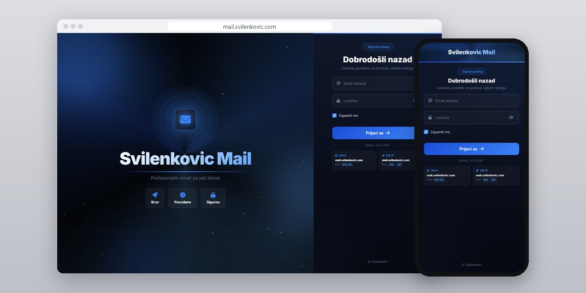
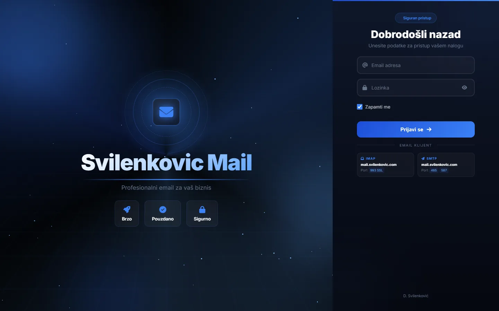
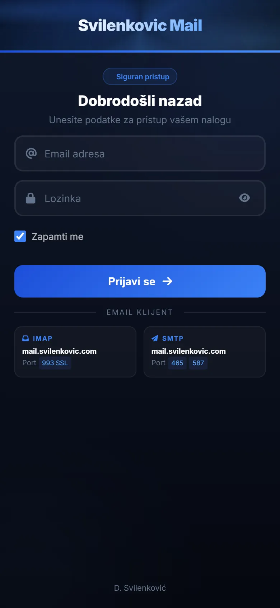

# Svilenkovic Mail

Webmail za moje sanduče i za sandučiće klijenata koje hostujem, sa nitima, push obaveštenjima, zakazanim slanjem i Android aplikacijom.

**[mail.svilenkovic.com](https://mail.svilenkovic.com/)** · [English](README.md)

> [!NOTE]
> Moj sopstveni proizvod. Izvorni kod je privatan. Ova stranica opisuje šta radi i kako je napravljen.

<table>
  <tr><td><b>Klijent</b></td><td>Sopstveni proizvod</td></tr>
  <tr><td><b>Delatnost</b></td><td>Webmail za hostovane sandučiće</td></tr>
  <tr><td><b>Lokacija</b></td><td>Srbija</td></tr>
  <tr><td><b>Vrsta</b></td><td>Webmail (PWA) sa Android aplikacijom</td></tr>
  <tr><td><b>Moj deo posla</b></td><td>Dizajn, izrada, hosting i održavanje</td></tr>
  <tr><td><b>Tehnologije</b></td><td>PHP, IMAP/SMTP, MariaDB, WebSocket, PWA, TWA</td></tr>
</table>

## O projektu

Svilenkovic Mail je webmail koji koristim svaki dan, a koriste ga i klijenti za sandučiće koje im hostujem. Poštu prikazuje u nitima razgovora, šalje push obaveštenja, poruku može da zadrži i pošalje kasnije, a na Androidu se instalira kao obična aplikacija.

Android aplikacija je Trusted Web Activity oko iste PWA, pa održavam jedan kod i nema drugog klijenta koji treba stalno usklađivati. Service worker kešira ljusku aplikacije, ali nikad samu poštu. Dodir na obaveštenje otvara inbox ili vraća u prvi plan prozor koji je već otvoren. Ko više voli mejl program na računaru ili telefonu, ne mora ručno da unosi podešavanja: svaki hostovani domen odgovara na zahteve za automatsko podešavanje, pa program sam nađe server na osnovu adrese.

## Šta sam uradio

- Niti razgovora koje drže odgovore na istu poruku zajedno
- Push obaveštenja koja otvaraju inbox ili ga vraćaju u prvi plan ako je već otvoren
- Zakazano slanje: poruka se napiše sada, a ode kasnije
- Android aplikacija kao TWA oko PWA, sa prečicama na početnom ekranu za inbox i novu poruku
- Automatsko podešavanje na svakom hostovanom domenu, pa se mejl programi na računaru i telefonu podese sami
- PHP preko IMAP-a i SMTP-a, uz MariaDB i poseban WebSocket servis

## Snimci ekrana

<table>
  <tr>
    <td width="68%" valign="top"></td>
    <td width="32%" valign="top"></td>
  </tr>
</table>

---

Izrada: [D. Svilenković](https://svilenkovic.rs).
